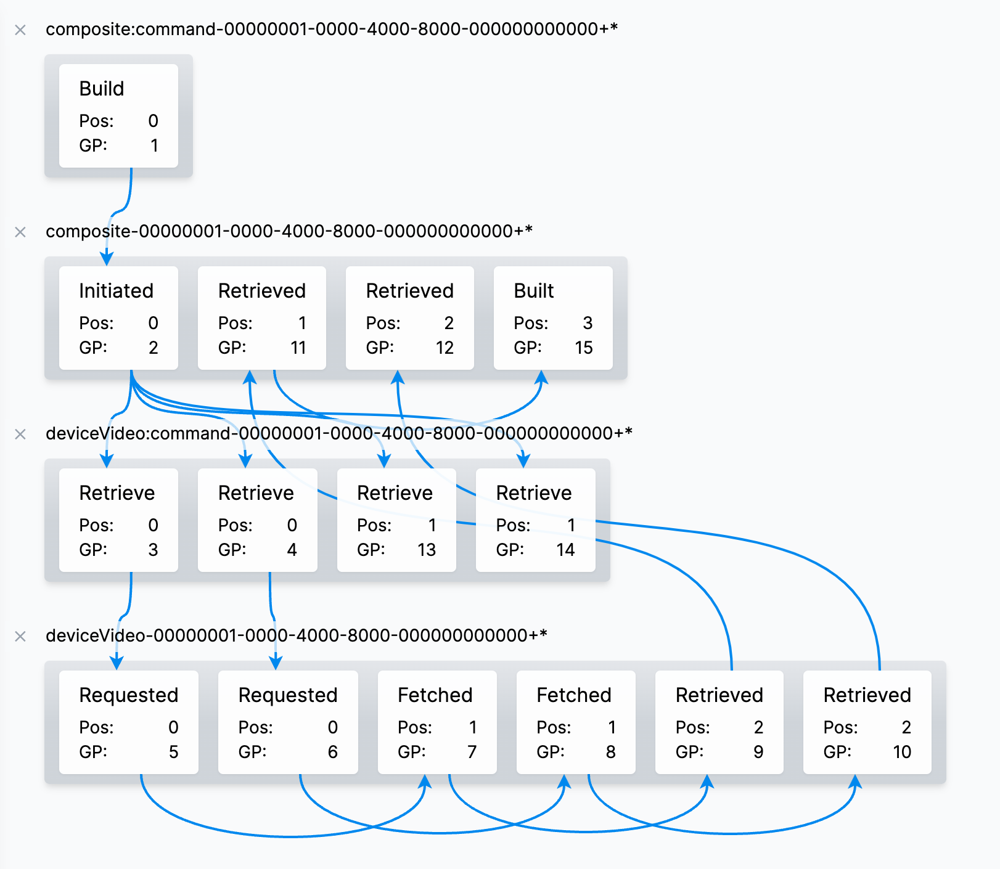

# Message DB Viewer



## Getting Started

Configure your message db settings:

```sh
cp settings/message_store_postgres.json{.example,}
```

Run the development server:

```sh
npm install
npm run dev
```

Open [http://localhost:5555](http://localhost:5555) with your browser to see the result.
